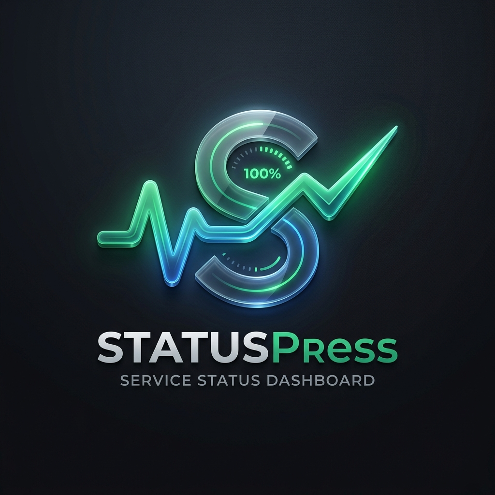

<p align="center">
  
</p>

# StatusPress 🚀

CIで定期的に更新されるスタティックファイルによるダッシュボードシステムです。

## 特徴
- **YAMLによる設定**: `config.yml` で監視対象のサービスを管理
- **依存関係の可視化**: サービス間の連携を `depends_on` で定義し、Mermaid.js で自動図示（Service Map）
- **プラグイン方式**: `plugins/` フォルダにスクリプトを置くだけでチェック項目を追加可能
- **スタティック生成**: CI (GitHub Actions) で実行され、GitHub Pages などでホスト可能
- **モダンデザイン**: ダークモード、レスポンシブ対応のプレミアムなUI

## ディレクトリ構成
- `config.yml`: サービスの設定（タグ、カテゴリ、説明、復旧手順、依存関係など）
- `plugins/`: チェックスクリプト格納場所
- `generate.js`: チェックを実行し `data/status.json` を生成するスクリプト
- `index.html`: ダッシュボードのフロントエンド
- `data/`: 生成されたステータスデータ

## 使い方

### 1. ローカルでの実行
```bash
# 依存関係のインストール
npm install

# ステータスチェックの実行
npm run generate

# プレビューの起動
npm run dev
```

### 2. プラグインの追加
`plugins/` ディレクトリに実行可能なスクリプトを作成します。
- 正常時: 終了コード `0` を返す
- 異常時: 終了コード `0` 以外を返す

### 3. 依存関係の設定
`config.yml` の各サービスに `depends_on: ["service-id"]` を記述することで、サービスマップ上に連携図が表示されます。

### 4. CI/CDの設定
`.github/workflows/status-check.yml` が15分ごとにチェックを実行し、GitHub Pages にデプロイするように設定されています。
GitHubリポジトリの Settings > Pages から、ソースを `GitHub Actions` に設定してください。

### 5. AIによる拡張
このリポジトリはAIアシスタント（Cursor, GitHub Copilot, Antigravityなど）による拡張を想定しています。
詳細は [Skills.md](./Skills.md) を参照してください。AIに対して「新しいサービスを追加して」と指示するだけで、プラグインの作成から設定ファイルの更新までを自動で行わせることができます。
